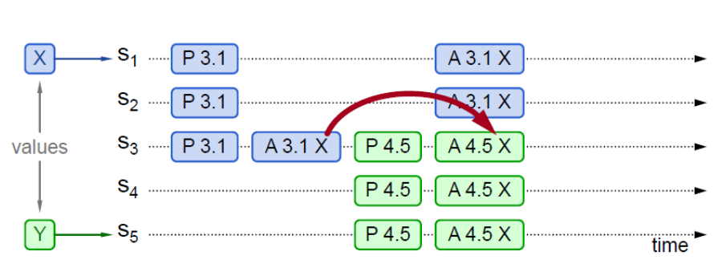
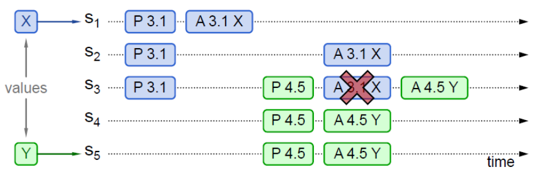
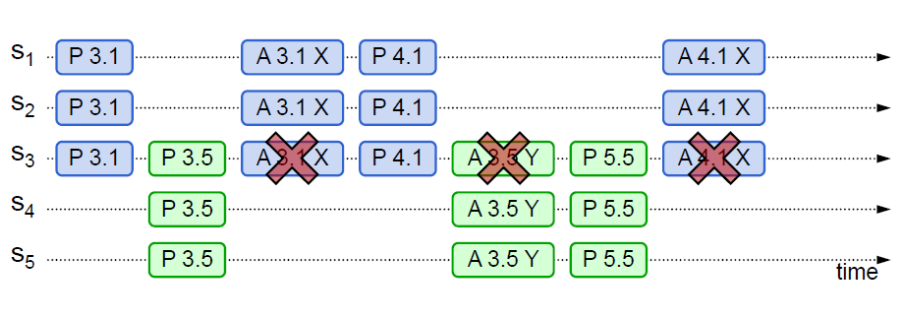

---
tags:
- 云计算
- 计算机
layout: post
date: '2025-11-28 01:07:23'
title: Paxos算法
author: jkofbr
header-img: img/header_img.jpg
catalog: true
---

# 正文
## 系统中角色
### Proposer
- 发起提案
### Acceptor
- 参与决策，回应`Proposer`提案
### Learner
- 不参与决策，仅学习最新达成一致的提案
## 算法流程
### Prepare阶段
*Prepare & Promise*
- `Proposer`
	- 生成全局唯一、递增的`Proposal ID`(一般用时间戳+Server ID)
	- 向所有`Accepter`发送==仅包含Proposal ID==的`Prepare`请求。
- `Acceptors`
	- 在收到`Prepare`请求后进行`Promise`承诺
#### `Promise`
- **两个承诺**
	1. 不再接受==`Proposal ID` <= `当前请求`==的`Prepare`请求
	2. 不再接受==`Proposal ID` < `当前请求`==的`Proposal`请求
- **一个应答**
	1. 在不违背前述承诺的情况下，回复已经`Accept`的提案中`Proposal ID`最大的那个提案的`Value`和`Proposal ID`(==**使Proposer达成一致**==)
### Accept阶段
*Proposal & Accept*
- `Proposer`
	- 在收到==多数==`Acceptor`的`Promise`后，向所有的`Acceptor`发出`Proposal`请求
- `Acceptor`
	- 在收到`Proposal`请求后进行`Accept`处理
### Learn阶段
- `Proposer`
	- 在收到==多数==`Accept`后(标志着决议通过)，向`Learner`发送决议结果
- `Learner`
	- 学习决议结果
## 伪代码

## 示例
- **注意**：$S_1$和$S_5$是`proposer`，其他是`Acceptor`
- P代表`Prepare`阶段，A代表`Accept`阶段
- 3.1和4.5是`Proposal ID`(3.1 ：3为时间戳，1为Server ID) 
- 示例1
	- 
	- $S_3$在收到$S_5$的`Prepare`请求后返回了——已经`Accept`的提案中`Proposal ID`最大的那个提案的`Value`和`Proposal ID`(详见**一个应答**)
	- $S_5$在收到过半数回复后，发现有来自$S_3$的`acceptedValue`返回，因此找寻所有回复中`acceptedProposal`最大的(即来自$S_3$的4.5)，将其所对应的`acceptedValue`(即来自$S_3$的Y)作为本次提案的`value`(==**使Proposer达成一致**==)
	- 后续该`Proposal`被`Accept`，所有节点达成一致
- 示例2
	- 
	- 过程类似示例1
- 示例3
	- 
	- $S_3$在接受[A 3.1 X]前就已经收到[P 4.5]，因此并未通过该`Proposal`(详见**两个承诺**)
- 示例4(活锁)
	- 
	- 两个`Proposer`交替在另一位`Accept`成功前`Prepare`成功，形成活锁(*Livelock*)
	- 可以通过随机数来决定`proposer`重新发送`Prepare`请求的间隔时间
## 理论推导过程
前提：若只有一个`Proposer`提出了一个`value`，那么这个`value`必须被最终选定。

由此推导出约束1
>[!highlight]
>P1：一个`Acceptor`必须接受它收到的第一个提案。

这又造成另外的问题
- 每个`Proposal`分别提出不同的`Value`，不同的`Acceptor`接受到了这些不同的`Value`，则会导致不同的`value`被选定
为了避免该问题，需要添加一个规定
- ==规定：一个提案被选定需要被**半数以上**的Acceptor接受==
但这个规定又要求每个`Acceptor`必须能够接受**不止一个**提案，否则将导致没有`Proposal`被`Accept`(每个`Proposal`只被少于半数的`Acceptor`通过)
此时一个`Proposal`仅包含`Value`已经不足以让`Acceptor`做出唯一的判断了，因此需要加入其他信息
- `Proposal`=`Value` ---> `Proposal` = `(n, Value)`
- 通过编号`n`的大小来选择
此时已经可以保证多个`Proposal`的选择了，但是仍需保证所有被选择`Proposal`具有相同的`Value`，否则又会出现不一致的情况

因此提出约束2

>[!highlight]
>P2：如果某个value为v的提案被选定了，那么每个编号更高的被选定提案的value必须也是v。

为了落实该约束，提出约束`Acceptor`的约束P2a

>[!highlight]
>P2a：如果某个value为v的提案被选定了，那么每个编号更高的被Acceptor接受的提案的value必须也是v。

为了实现P2a又需要对`Proposer`做出规定P2b，否则若有多个`Proposer`持有不同’`Value`的情况下，仅会有第一个`Proposal`被接受，其他的`Proposer`的`proposal`则一直无法通过，导致其无法与大家同步

>[!highlight]
>P2b：如果某个value为v的提案被选定了，那么之后任何Proposer提出的编号更高的提案的value必须也是v。

为了实现P2b，仅需满足P2c和P1a即可

>[!highlight]
> P2c：对于任意的N和V，如果提案[N, V]被提出，那么存在一个半数以上的Acceptor组成的集合S，满足以下两个条件中的任意一个：

- S中每个Acceptor都没有接受过编号小于N的提案。
	- 若S中每个Acceptor都接受了编号**大于**N的提案
		- 则P2b成立，因为该提案[N, V]不会被选定
- S中Acceptor接受过的最大编号的提案的value为V。
>[!highlight]
>P1a：Acceptor可以接受（Accept）编号为n的Proposal当且仅当它没有回复过一个具有更大编号的Prepare消息。

- 易看出P1a同时也能推出P1
- 因此P2c和P1a是理论的基础

